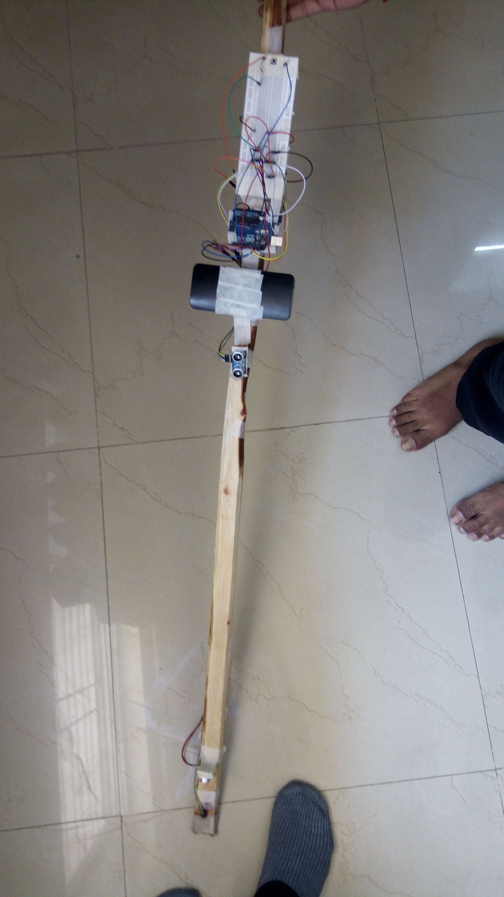

# Final-year-project
Smart Blind Stick
 
## This project requires the following things:

* **Arduino Uno**
* **Android Studio**
* **Bluetooth Adapter**
* **Buzzer**
* **Bread Board**
* **Bunch of wires**
* **Power bank or battery**
* **Button**
* **2 Ultrasonic sensors**

## This project is having the following features:

* **Calling feature through speech to text**
* **Text message feature through speech to text**
* **Sending location to our relatives**
* **Double tap on screen to start navigation feature. Here the current location is automatically taken by the application and you can directly say the destination. Google maps will find the shortest path associated with it.**
* **Blind person can get to know his/her location also from mobile**
* **When obstacle is in a range of 3m then the buzzer will start making sound due to which the user will get to know that there is an obstacle in front.**

## For using the features related to mobile the blind person will have to say the following things:

* **Call**(name of person saved in the blind person's phone)
* **Send text to**(name of person saved in the blind person's phone)
* **Send my location to**(name of person saved in the blind person's phone)
* **Tell me my location**

## Smart Blind Stick:

* **So by using this stick the blind person can go anywhere without any hesitation and with full confidence!!**
